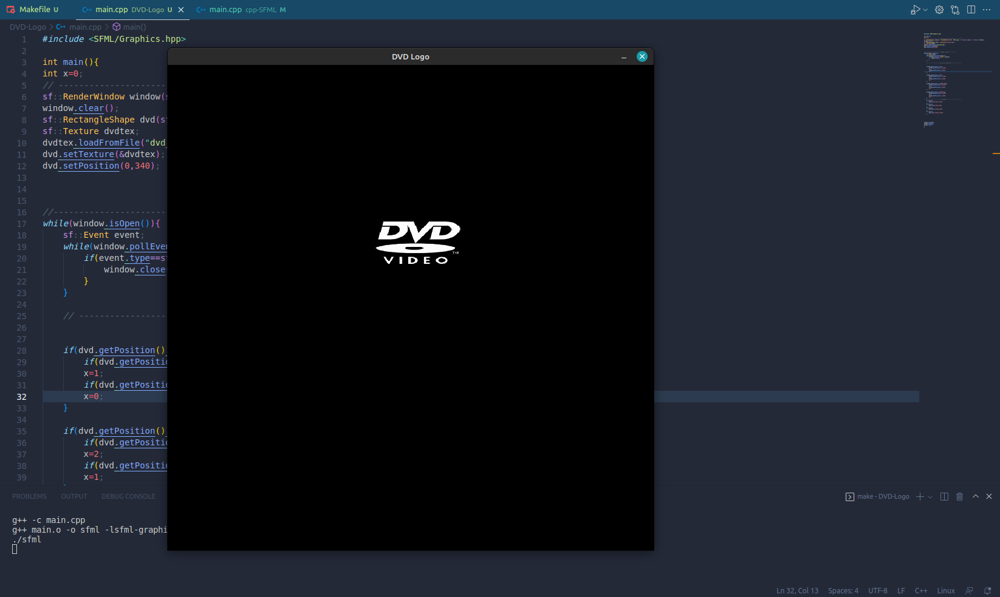

# DVD LOGO

Simple Drawing Board using C++ SFML library

 
<b>
Steps:
</b>

 -Install SFML

 -Clone this Repository

 -Then Type "make" in CLI

 -Open SFML.exe

 
 
<a href="https://www.youtube.com/playlist?list=PL21OsoBLPpMOO6zyVlxZ4S4hwkY_SLRW9">Learn SFML</a>
 
 

